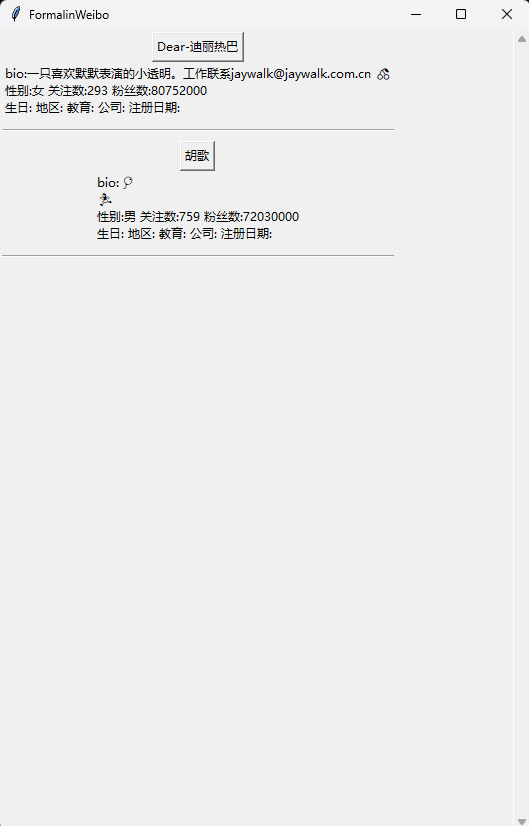

## FormalinWeibo

## 简介

FormalinWeibo是一个本地微博浏览工具，将用户的微博本地保存后，可以用本工具浏览。
支持浏览多个用户的微博，包括评论，图片，文本。视频会使用自带播放器播放。
可以在Windwos，Mac，Linux上运行。




## 使用

### Step1 保存微博
首先你需要爬取微博，如何爬取微博需要使用[weibo-crawler](https://github.com/dataabc/weibo-crawler)这个工具，并且要使用写入Sqlite选项，
这样爬取结束后会得到一个weibodata.db文件，把这个文件放到本项目的根文件夹下面(跟main.py同级)。
FormalinWeibo会读取这个文件里面的微博展示。

### Step2 安装依赖
能拿到weibodata.db想必你已经安装好了python，那么接下来继续安装FormalinWeibo的依赖。
用命令行输入：

```bash
pip install -r requirements.txt
```

如果安装出现问题(没有问题直接跳到step3)，建议最好在venv环境下进行，先建立venv:
```bash
python3 -m venv venv
```
然后再激活venv:

在Linux/MacOS下
```bash
source venv/bin/activate
```
在Windows下
```bash
venv\Scripts\activate
```
完成后再重新安装依赖

如果提示没有安装tkinter，则需要根据系统安装
- **Ubuntu/Debian**: `sudo apt install python3-tk`
- **Fedora**: `sudo dnf install python3-tkinter`
- **Arch Linux**: `sudo pacman -S tk`
- **MacOS/ Window**: 一般自带，如果没有请重新安装python


### Step3 运行脚本
直接运行脚本即可

```bash
python .\main.py
```

## 声明

本工具非盈利，仅供学习参考，请勿用于非法用途
